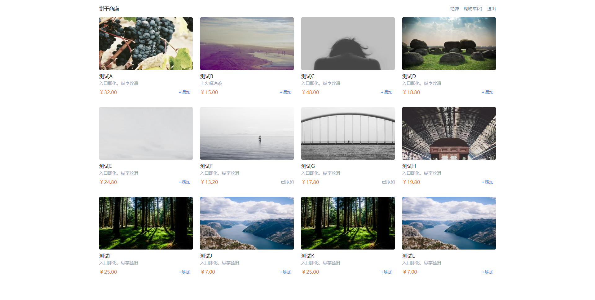
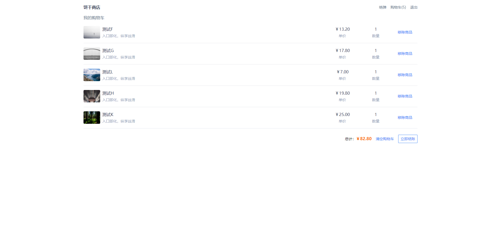

# 关于项目
本项目源于一篇文章 - [Clean Architecture on Frontend](https://bespoyasov.me/blog/clean-architecture-on-frontend/)，讲的是作者对前端架构的一些思考和实践，通过实现简单的饼干商店案例，串联起很多有趣的内容。

从文章的内容中我收获很多，纸上得来终觉浅，于是我实践了文章中的饼干商店。本项目实践思路与文章大体一致，但不同的是我用`vite`启动的项目，并用`tailwind.css`作为样式库，同时部分页面略有改动。

预览地址：[https://juetan.github.io/clean-architecture-store/](https://juetan.github.io/clean-architecture-store/)。

# 页面预览



# 运行项目
1. 确保本地安装`Node`和`Git`。
2. 克隆项目到本地
```
git clone https://github.com/juetan/clean-architecture-store.git
```
3. 进入到项目目录，安装依赖
```
npm install
```
4. 启动项目
```
npm run dev
```
5. 打开浏览器，访问`localhost:5173`即可。

# 最后
如果在使用过程中遇到问题，欢迎向我提PR。
